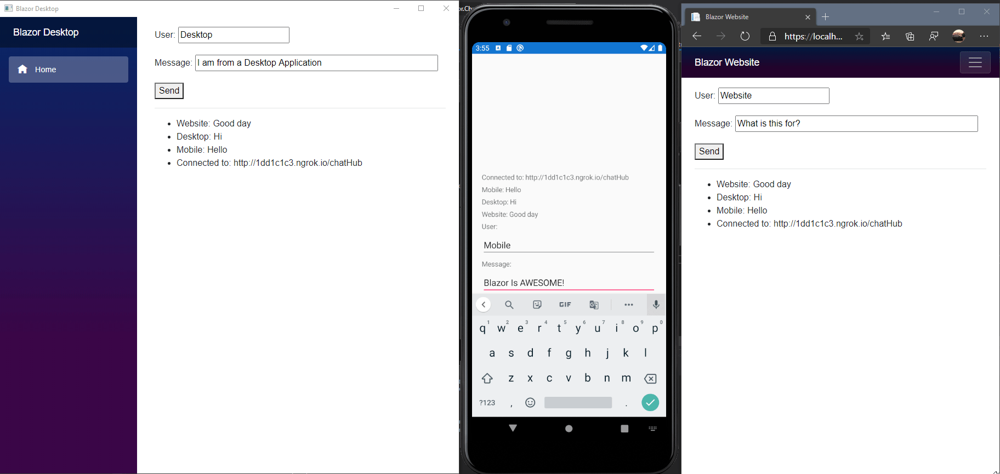

# About

This is yet another Chat application, but with three clients; Website, Desktop and Mobile. The twist is they are all using Blazor in some form or fashion.

# Project

This project uses three different types of Blazor.

- [Mobile Blazor Bindings](https://docs.microsoft.com/en-us/mobile-blazor-bindings/) is used in the ***Xamarin Mobile Application***.
- [Blazor WebAssembly](https://docs.microsoft.com/en-us/aspnet/core/blazor/hosting-models?view=aspnetcore-3.1#blazor-webassembly) is used in the ***WebWindow Desktop Application***.
- [Blazor Server](https://docs.microsoft.com/en-us/aspnet/core/blazor/hosting-models?view=aspnetcore-3.1#blazor-server) is used for the ***Website***.

# Example Clip

# Running the Clients

The application should run pretty seamlessly after the dependencies are installed and the solution is opened from Visual Studio 2019.  

To help with my development of the mobile application I use ngrok to proxy the API Server.
This way I am able to access the in development APIs from the Mobile Application. 

The ServerUrl should be set in each clients appsettings.json, this will point to the SignalR Server, the project is included in this solution as well.

## Dependencies

Here is a list of necessary software:
- Visual Studio Community 2019 [Install from here](https://visualstudio.microsoft.com/vs/)
	- Needs Workloads Installed:
		- ASP.NET and web development
		- Mobile development with .NET
		- Universal Windows Platform development (optional for UWP) 
- .NET Core [Install from here](https://dotnet.microsoft.com/download/dotnet-core)
- Windows Desktop will need the current Edge built on Chromium to function.

## Using ngrok

~~~
# Host port 5800 in ngrok
.\ngrok.exe http 5800
~~~
